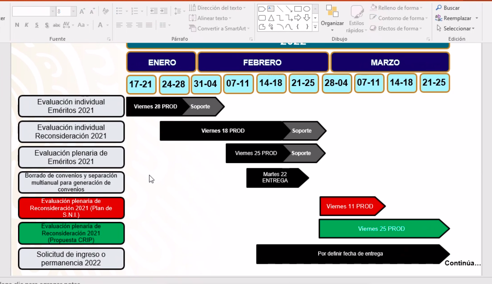

- [[Seguimiento SNI]]
	- Reconsideración de plenarias
	  :LOGBOOK:
	  CLOCK: [2022-02-17 Thu 17:40:21]--[2022-02-17 Thu 17:40:22] =>  00:00:01
	  :END:
	- Plan de trabajo para el SNI
	  
- [[Proyecto Distribución de becas]]
	- DONE revisar el último documento de carga y revisar la información que se está cargando
	  :LOGBOOK:
	  CLOCK: [2022-02-18 Fri 00:01:10]--[2022-02-18 Fri 00:01:14] =>  00:00:04
	  :END:
		- DONE NO COINCIDE Entidades,
		  :LOGBOOK:
		  CLOCK: [2022-02-18 Fri 02:48:32]--[2022-02-18 Fri 02:48:33] =>  00:00:01
		  :END:
		- LATER Cómo se sabe cual es SNP y cual no
		- LATER Existen muchos dupilcados, ejemplo 933606
	- DONE actualizar el script para cargar el excel en la base de datos de distribución de becas
	  :LOGBOOK:
	  CLOCK: [2022-02-18 Fri 00:01:17]--[2022-02-18 Fri 02:48:11] =>  02:46:54
	  :END:
	- NOW revisar que las reglas que actualmente se tienen, estén filtrando bien los registros
	  :LOGBOOK:
	  CLOCK: [2022-02-19 Sat 10:37:25]
	  :END:
	- LATER para cada tarea que se ejecuta, se deberá de guardar también las reglas que se aplican
	  :LOGBOOK:
	  CLOCK: [2022-02-21 Mon 11:10:57]--[2022-02-21 Mon 11:10:58] =>  00:00:01
	  :END:
	- LATER guardar información dentro del objeto de Tarea, con la finalidad de poder gráficar totales
	- LATER descargar en excel la matricula que se está filtrando
	-