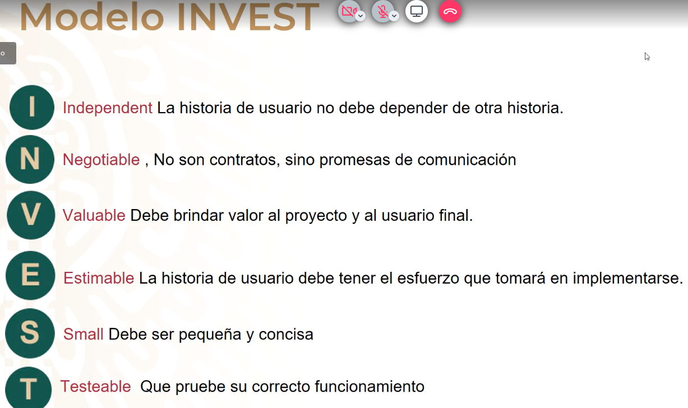
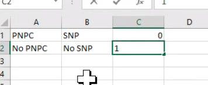

- [[Prácticas]]
	- Estimación de desarrolllo, modelo INVEST
		- 
	- [Seguimiento diario de impedimentos](https://docs.google.com/document/d/1xTJZLAY4Gc0sYfUOGO-YPbLEWRh1nGB7/edit)
-
- Programa SNP y no SNP
	- 
- [[Comandos linux]]
	- comprimir directorio #linux #comando #comprimir
		- ``` sh
		  tar -zcvf archive-name.tar.gz source-directory-name
		  ```
	- descromprimir directorio
		- ``` sh
		  tar -zxvf archive-name.tar.gz -C /path
		  
		  ```