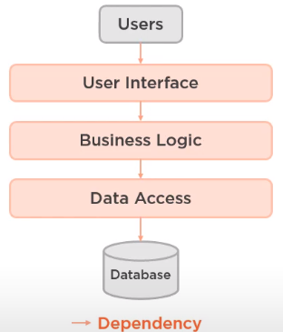
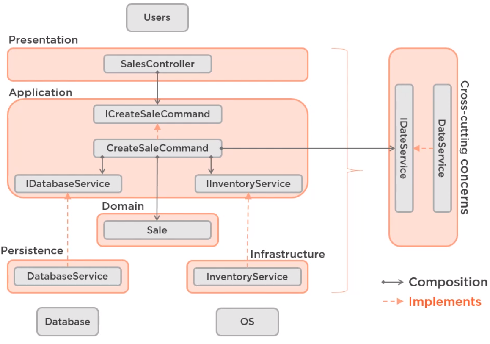

- {{renderer :tocgen}}
- Introduction
	- Focus of the architecture
		- Enterprise Applications
		- Agile Architecture
		- Top 7 ideas
- What is Software Architecture
	- High level
	- structure
	- layers
	- components
	- relationships
- Levels of Architectural Abstraction
	- 
- Bad vs good architecture
	- Bad architecture
		- complex
		- incoherent
		- Rigid
		- Brittle
		- Untestable
		- Unmaintainable
	- Good Arquitecture
	- simple
	- understandable
	- flexible
	- emergent
	- testable
	- maintainable
- What is Clean Architecture
	- > Architecture that is designed for the inhabitants of the architecture... not for the architect... or the machine
- Why ivest in clean architecture?
	- cost/benefit
	- minimize cost
	- maximize value
	- maximize ROI
	- focus o the essential
	- build onliy what is necessary
	- optimize for maintainability
- Layers of the demo
	- Presentation -details
		- user interface
	- Application - essential
		- use cases of the application
	- Domain - essential
		- problem domain
		- business domain
	- Infraestructure
		- interface into the operating system
		- third party dependencies
	- Persistance - detail
		- interfaces to the persistence data
	- Common
		- crosscutting concerns
- ## Domain-centric Architecture
	- Pros
		- focus on domain
		- less coupling
		- allows for DDD
	- Cons
		- change is difficult
		- requires more thought
		- initial higher cost
	- Implementations
		- ((634c4de9-b83e-4078-9859-54d3a2f282fc))
	- First of all, we need to know the differences between data base centric architectura and domain centric architecture 
	  
	- domain a use cases are essential
	-
	- Examples
		- 
		- Hexagonal Architecture
			- by [Alistair](https://alistair.cockburn.us/hexagonal-architecture/) main articule
			- 
		- Onion Architecture
			- by [Jeffrey Palermo](https://jeffreypalermo.com/2008/07/the-onion-architecture-part-2/)
			- 
		- Clean Architecture
			- by [Uncle bot](https://blog.cleancoder.com/uncle-bob/2012/08/13/the-clean-architecture.html)
			- it include the Ivar jacobsons [BCE](https://magnus-k-karlsson.blogspot.com/2019/03/entity-control-boundary-ecb-pattern.html)
			- 
			-
		-
- ## Application Layer
	- Three-layer Architecture
		- 
		- This is used for CRUD applications
		- Not for domain driven architectures. The domain is not present
	- Modern Four-layer Architecture
		- 
		- 
		- presentation, user interface
		- application, use cases of the aplication asaxecutable code and abstractions
			- has interfaces for his dependencies
			- it use inversion of control framework
		- domain, has the domain logit of the aplication
		- cross-cutting concerns, are aspects of the application that cross all the layers of the system
	- Prod
		- focus on use cases
		- easy to understand
		- follow Dependency Injection principle
	- Cons
		- Additional layer cost
		- requires extra thought
		- IoC is counter-intuitive
- Commands and Queries
	- Command Query Responsibility Separation Architecture (CQRS)
	  id:: 634c4de9-b83e-4078-9859-54d3a2f282fc
	- 
	- It is domain-centric Architecture
	- Command-query separation
		- Command
			- does something
			- should modify state
			- should not return a value
			- must be optimized for writing data
		- Query
			- answer a question
			- should not modify state
			- should return a value
			- must be optimized for reading data
		- Exceptions area:
			- Pop a stack : remove item (command) return pop item (query)
			- Create a new record: when create record (command) we must return the new ID (query)
	- Three types of CQRS
		- Single-database CQRS
			- 
		- Two-database CQRS
			-
		-
- Functional Organization
- Microservices
- Testable Architecture
- Evolving the Architecture