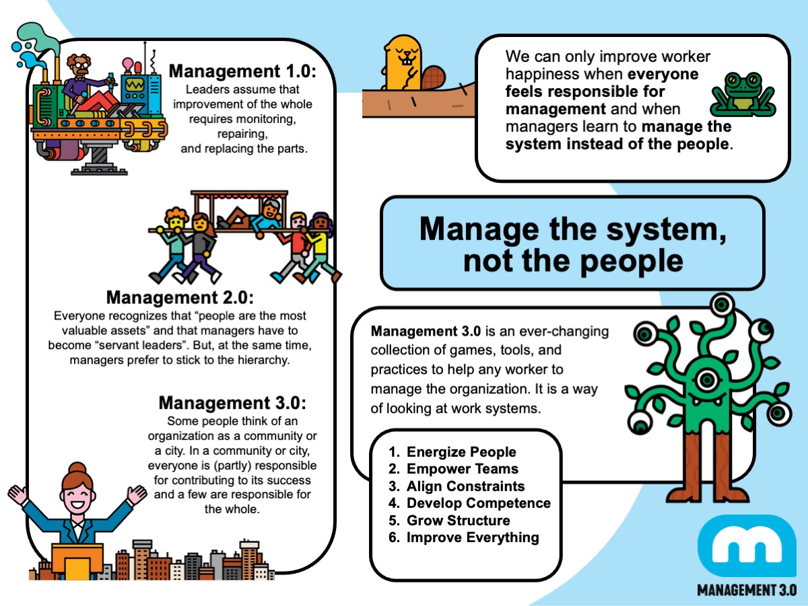

- definición
	- 
	- **Creative workers**, is the new word for  knowledge workers, are workers whose main capital is knowlege. Creative workers work in networks no in hierarchies and work in a **cretive economy** #concept
	- **Systems thingking** represents the process of understanding how human systems (including people, teams, and organizations) behave, interact with their envoronment, and influence each other #concept
	- **Complexity thinker** applies bot: insights from scientific research into complex systems and understanding of the workings of social systems #concept
	- > The ((63700238-f5a3-4647-b5f7-a57fba0be852)) is as important to managers as the laws of relativity are to physicists
	- change the word control by lead, coach, inspire, motivate, constrain, govern and help
	- >whit a complex system there is no such thing as central control
	-
- Motivate people with better rewards
	- Kudo box and kudo cards
- improve communication and understanding
	- Personal maps
- empower workers with clear boundaries
	- Delegation boards and delegation poker
- define the culture by sharing stories
	- value stories and culture books
- make time for exploration and self-education
	- exploration days and internal crowdfunding
- share knowlege, tools, and practices
	- business guilds and corporate huddles
- learn how to offer constructive feedback
	- feedback wraps and unlimited vacation
- measure performace the right way
	- metrics ecosystem and scoreboard index
- pay people according to their merits
	- merit money
- discover real engagement of workers
	- moving motivators
- aim for a happier organization
	- happiness door
- never stop experimenting
	- conclusion
- learn from successes and failures
	- questions and celebration grids