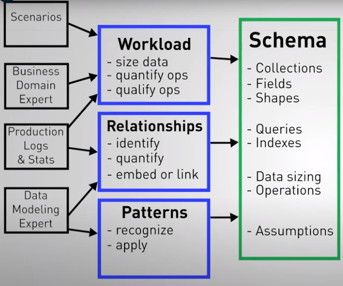
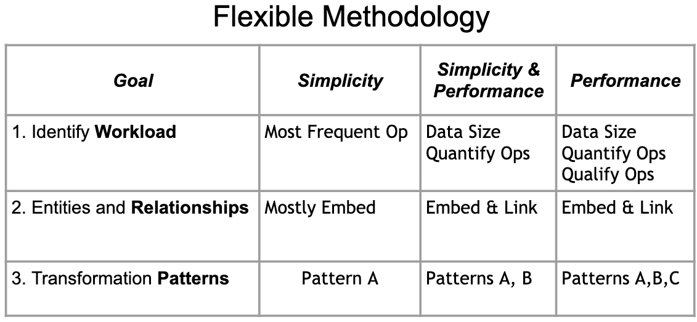

- Bes practices [Referencia](https://www.mongodb.com/developer/products/mongodb/mongodb-schema-design-best-practices/)
- Data modelling methodology
	- 
	- Workload
		- data size, imortant reads and writes
	- Relationships
		- idnetify them, link or embed the related entities
	- Patterns
		- apply the ones for needed optimizations
	- 