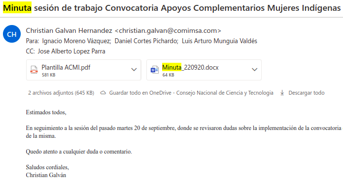

- La plantillla para las dos se mandó el 22 de septiembre
  id:: 633dfe0b-7b06-43ec-bb93-f98e7dbf853f
- {:height 379, :width 696}
- apoyo complementario de mujeres indigenas
	- se espera que sea para el 17 el 22 de octubre
	- TODO se le deberá de solicitar a ignacio las combinaciones de los apoyos de la convocatoria, que al parecer son sólo tres
	- solicitar que nos puedan compartir
- Para la de discapacidad
	- se estima liberar para el 24 poner la del 28 de octubre
	- está solicitando el documento Constancia de discapacidad
	- TODO solicitar la plantilla de solicitud
	- se requiere dos semanas y media
-
- En la convocatoria de maternidad, están solicitando anexo 1 y visa
-
- cvu rt, id, clave, nombre del documento, adjunto