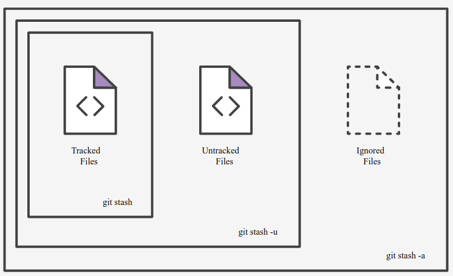

- [Git stash](https://www.atlassian.com/git/tutorials/saving-changes/git-stash) 
  
	- guardar en el **stash**
	  ```sh 
	  git stash
	  ```
	- guardar en el **stash untracked** files
	  ``` sh
	  git stash -u
	  ```
	- guardar en el **stash ignore** files
	  ``` sh
	  git stash -a
	  ```
	- sacar del **stash** los archivos
	  ```sh
	  git stash pop
	  ```