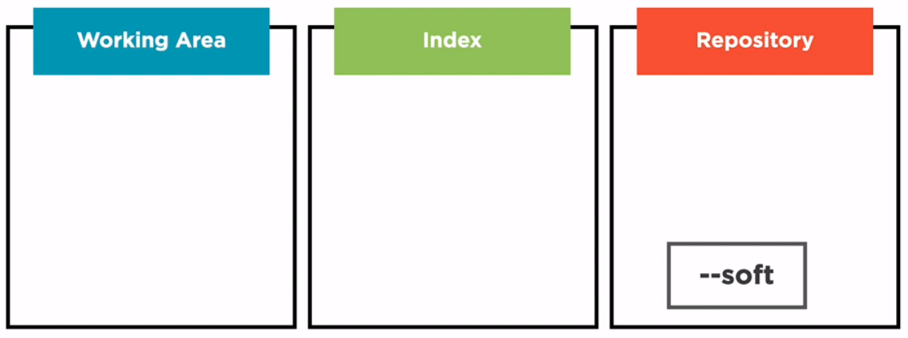
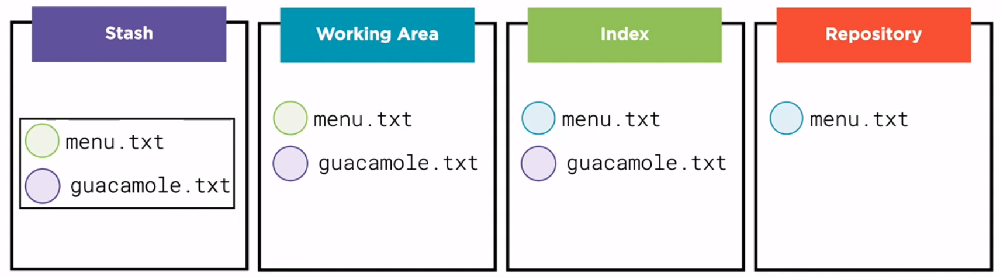

- git use sha-1 algorithm, it is impossible to have two equals hashes.
- there is a new command for `git checkout branch-name`, it is `git switch branch-name`
- there is two kind of commands on git `plumbing commands` and `porcelain commands`
	- The plumbing commans are lower-level commands
	- The porcelain commands are friendly commands
- The sequence of commands of `git fetch` and `git merge` are both in `git pull`
- Never rebase shared commits
- Forks and pull request
	- both area social features, not area part of git. Each provider, like github o gitlab, manage this part in a different way
	- The concept of upstream
		- 
- ### The four areas of git
	- Stash
	- Working area
	- Index
	- Repository
- ### The two questions to understand what a command does
	- > how does this command move information across the Four Areas?
	- >How does this command change the repository?
	-
- ## git diff
	- `git diff` compare the files between the working area and the index
		- 
	- `git diff --cached` compare content between index and repository
		- 
- ## git checkout
	- when we checkout a branch with `git checkout branch-name` command the next things happend
		- 1. the `HEAD` points at branch-name or commit hash
		  2. The repository files copy into the index and the working area
		- 
- ## git rm
	- `git rm --cached <file-name>` remove file from index but no from working area
		- this is oppositive of `git add <files>`
		- other option is `git reset HEAD <files>`
	- `git rm <file-name>` remove the file from index and the working area
- ## git mv
	- there are two ways
		- First way
			- 1. `mv old-name-file.tx new-name-file.txt`
			  2. `git add new-name.-filet.txt`
			  3. `git add old-name-file.txt`
		- Second way
			- 1. `git mv old-name-file.txt new-name-file.txt`
- ## git reset
	- moves the current HEAD and branch to a specific commit
	- moves the current branch, and optionally copies data from the Repository to the other areas
		- --soft no copy nothing into index or working area
		- --mix copy the repository data into the index (default)
		- --hard copy data into index and working area
	- ### uses
		- this command is used for revert changes in the git history.
	- 
	-
	- `git reset --hard`
		- > this is used for clean the working area with `git reset --hard HEAD`
		- 
	- `git reset --mix` this is the default option
		- > this is used for unstagged files with the command `git reset HEAD`
		- 
	- `git reset --soft`
		- 
- ## git stash
	- this command copy all the data into de index and the working area ant put it into the stash area and copy
	- 
	- Uses
		- `git stash`
		- `git stash --include-untracked` this is the best for most cases
	-
- ## Commands that move brances
	- commit
	- merge
	- rebase
	- pull
	- reset
	- ...